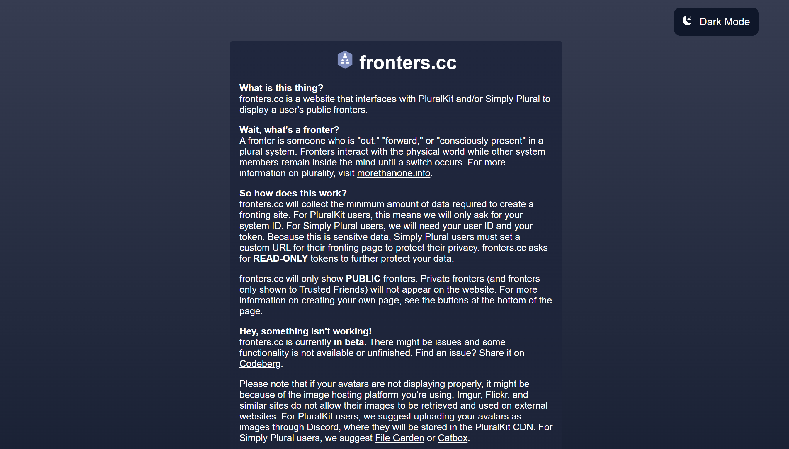

# fronters.cc
**What is this thing?**  
fronters.cc is a website that interfaces with <a href="https://pluralkit.me">PluralKit</a> and/or <a href="https://app.apparyllis.com/">Simply Plural</a> to display a user's public fronters.

**Wait, what's a fronter?**  
A fronter is someone who is "out," "forward," or "consciously present" in a plural system. Fronters interact with the physical world while other system members remain inside the mind until a switch occurs. 
For more information on plurality, visit <a href="https://morethanone.info/">morethanone.info</a>.

**So how does this work?**  
fronters.cc will collect the minimum amount of data required to create a fronting site. For PluralKit users, this means we will only ask for your system ID. For Simply Plural users, we will need your user ID and your token.
Because this is sensitve data, Simply Plural users must set a custom URL for their fronting page to protect their privacy. fronters.cc asks for <strong>READ-ONLY</strong> tokens to further protect your data.
fronters.cc will only show <strong>PUBLIC</strong> fronters. Private fronters (and fronters only shown to Trusted Friends) will not appear on the website. For more information on creating your own page, see the buttons at the bottom of the page.

**Hey, something isn't working!**  
fronters.cc is currently <strong>in beta</strong>. There might be issues and some functionality is not available or unfinished. Find an issue? Share it on <a href="https://codeberg.org/fronterscc/fronterscc/issues">Codeberg</a>.
Please note that if your avatars are not displaying properly, it might be because of the image hosting platform you're using. Imgur, Flickr, and similar sites do not allow their images to be retrieved and used on external websites. For PluralKit users, we suggest uploading your avatars as images through Discord, where they will be stored in the PluralKit CDN. For Simply Plural users, we suggest <a href="https://filegarden.com/">File Garden</a> or <a href="https://catbox.moe/">Catbox</a>.

